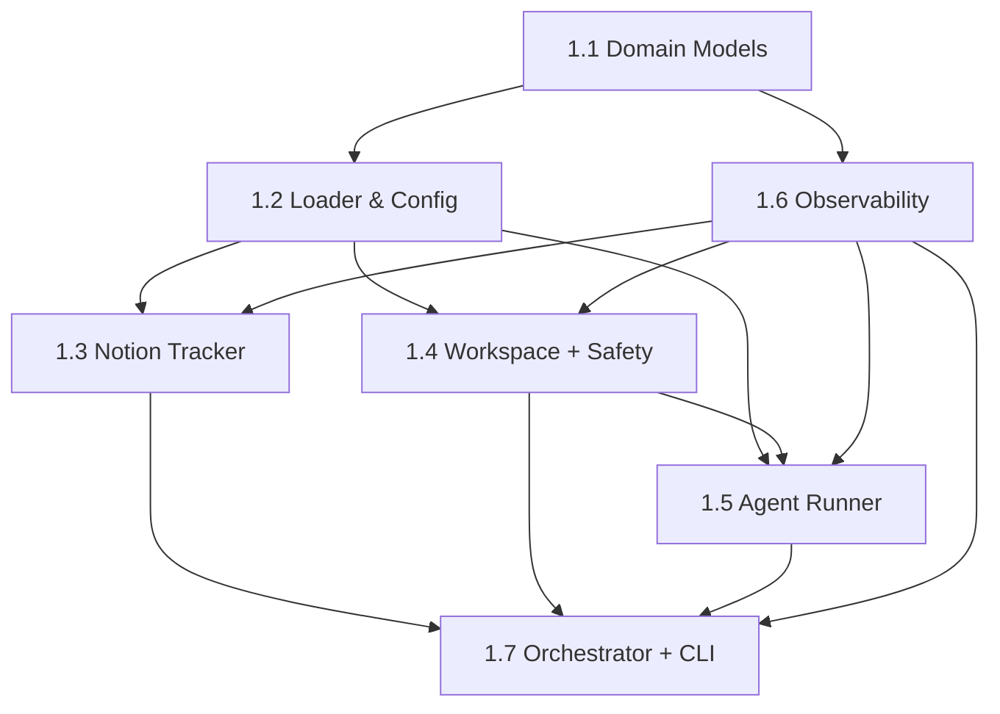

# Unit-of-Work Dependency Matrix — MVP Walking Skeleton

> "X depends on Y" ⇒ Y must ship before X. The bridge maps this to `blockedBy` on X and mirrors it as
> `blocks` on Y. The graph is **acyclic**. Root = Unit 1.1.

## Dependency table

| Unit | Title | Depends on (blockedBy) | Rationale |
|------|-------|------------------------|-----------|
| 1.1 | Project Init & Core Domain Models | — | Root: defines §4 types + port interfaces. |
| 1.2 | Workflow Loader & Typed Config | 1.1 | Uses `WorkflowDefinition` / `ServiceConfig` types. |
| 1.6 | Observability (Logging & Status) | 1.1 | Implements `Logger` / `StatusSurface` ports. |
| 1.3 | Notion Tracker Client | 1.1, 1.2, 1.6 | Needs `Issue` type, `tracker.*` config, a logger. |
| 1.4 | Workspace Manager & Safety | 1.1, 1.2, 1.6 | Needs `Workspace` type, `workspace.root` config, a logger. |
| 1.5 | Agent Runner & Prompt Rendering | 1.1, 1.2, 1.4, 1.6 | Needs `RunAttempt`/`Issue`, `agent.*` config, the workspace cwd, a logger. |
| 1.7 | Orchestrator, Reconciliation & CLI | 1.2, 1.3, 1.4, 1.5, 1.6 | Integrating spine: wires config + tracker + workspace + agent + observability. |

## Build/unblock waves (how the engine will pick them up)

```
Wave 0:  1.1
Wave 1:  1.2   1.6                 (both unblock after 1.1)
Wave 2:  1.3   1.4                 (parallel, after 1.2 + 1.6)
Wave 3:  1.5                       (after 1.4)
Wave 4:  1.7                       (after 1.3 + 1.4 + 1.5 + 1.6)
```

## Mermaid dependency graph



## Acyclicity

Topological order exists: `1.1 → {1.2, 1.6} → {1.3, 1.4} → 1.5 → 1.7`. No back-edges; graph is a DAG.
