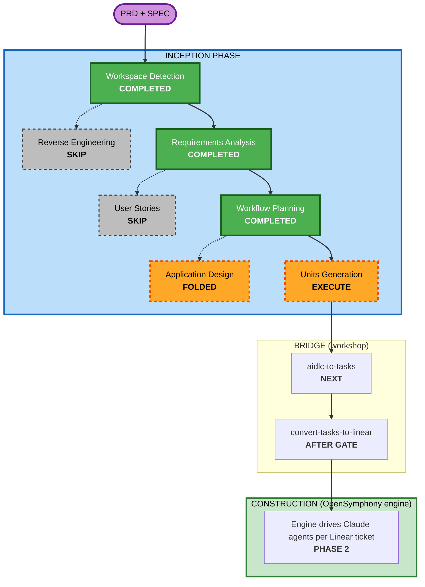

# Execution Plan — Symphony Orchestrator (Run 2, MVP-first)

> **Stage:** INCEPTION → Workflow Planning.
> **User directive:** fewest questions, follow PRD/spec, **backlog option B (MVP only)**, generate
> first work units ASAP. To honor "ASAP", the intermediate per-stage approval gates are
> **consolidated into one review gate** presented after Units Generation, immediately before the
> consequential outward step (`/aidlc-to-tasks` → Linear). Nothing irreversible happens before that
> gate — only local docs are produced.

## Detailed Analysis Summary

### Change Impact Assessment
- **User-facing changes:** Yes — a CLI daemon (`symphony ./WORKFLOW.md`) operated from a terminal.
- **Structural changes:** Yes — greenfield layered architecture (PRD §6, spec §3.2).
- **Data model changes:** Yes — the §4 domain model (Issue, WorkflowDefinition, ServiceConfig,
  Workspace, RunAttempt, OrchestratorState).
- **API changes:** No external API (no HTTP/JSON per D2/D8); internal layer interfaces only.
- **NFR impact:** Yes — safety invariants, reliability/graceful-degradation, bounded concurrency.

### Risk Assessment
- **Risk Level:** Medium. Subprocess control + filesystem confinement + concurrency are the hot spots,
  mitigated by the three mandatory safety invariants (FR11–FR13) and bounded global concurrency.
- **Rollback Complexity:** Easy (greenfield; in-memory state; no DB; no destructive tracker writes —
  the orchestrator is a reader/scheduler, PRD §2).
- **Testing Complexity:** Moderate (unit tests per layer; one end-to-end happy-path slice for the MVP
  gate).

## Workflow Visualization

## Phases to Execute / Skip

### INCEPTION PHASE
- [x] Workspace Detection — COMPLETED (greenfield)
- [x] Reverse Engineering — SKIP. *Rationale:* no existing target code.
- [x] Requirements Analysis — COMPLETED (`../requirements/requirements.md`)
- [ ] User Stories — **SKIP**. *Rationale:* infrastructure daemon; personas (Operator, Coding agent,
  Board author) already defined in PRD §4; acceptance criteria are captured per-unit as FRs. Adds no
  value at MVP scope.
- [x] Workflow Planning — COMPLETED (this document)
- [ ] Application Design — **FOLDED into Units Generation**. *Rationale:* the component map (8
  components / 6 layers) and their interfaces are already specified in PRD §6 and spec §3.2; method-
  level design belongs to Construction (per-unit Functional Design, driven by the engine). A concise
  component overview is embedded in `unit-of-work.md` rather than producing separate
  `components.md`/`component-methods.md`/`services.md` — consistent with the user's minimalism directive.
- [ ] Units Generation — **EXECUTE**. *Rationale:* this is the deliverable the user asked for; it
  produces the bridge-ready working units for the MVP.

### BRIDGE (workshop-specific)
- [ ] `aidlc-to-tasks` — after the review gate.
- [ ] `convert-tasks-to-linear` — after the review gate, with `--project-slug`.

### CONSTRUCTION
- Executed by the **OpenSymphony engine** per Linear ticket (Phase 2). Not run by the planning AI.

## Decomposition strategy (preview of Units Generation)

- **One milestone this pass:** `M1: MVP Walking Skeleton` (Q1 = B). The Deferred set becomes
  `M2: Core Conformance Completion` on a later INCEPTION re-run.
- **Seven working units**, dependency-ordered so the OpenSymphony engine can pick them up as they
  unblock. Foundations first (domain models, config/loader, observability), then the three swappable
  adapters (tracker, workspace, agent) in parallel, then the integrating orchestrator spine.
- Each unit preserves the spec §3.2 layer boundary it owns, so the deferred items slot in without
  rework (PRD §5.3 note).

## Success Criteria
- **Primary Goal:** publish a clean, dependency-ordered MVP backlog the engine can execute to reach
  the **MVP gate** (PRD §9).
- **Key Deliverables:** `requirements.md`, this plan, `unit-of-work*.md` (×3), then the task package.
- **Quality Gates:** the three safety invariants are explicit acceptance checkboxes; `aidlc-to-tasks`
  output passes the `convert-tasks-to-linear` validator (exit 0).
