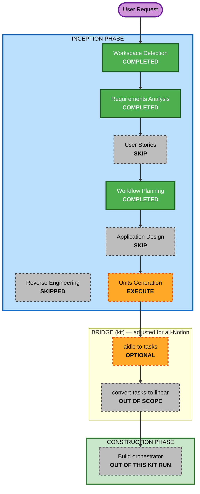

# Execution Plan — Symphony Orchestrator MVP (Walking Skeleton)

## Detailed Analysis Summary

### Change Impact Assessment
- **User-facing changes**: No GUI. Operator-facing = terminal logs + simple status line only.
- **Structural changes**: Yes — brand-new greenfield system (multi-component daemon).
- **Data model changes**: Yes — normalized Issue model + in-memory orchestrator state (no DB).
- **API changes**: No external API (HTTP server out of scope). Internal contracts: Notion MCP read,
  Claude Code subprocess.
- **NFR impact**: Filesystem-safety invariants (mandatory), secret handling, in-memory recovery.

### Risk Assessment
- **Risk Level**: Low (experimental MVP, isolated, no production data, easy rollback).
- **Rollback Complexity**: Easy (greenfield, no migrations).
- **Testing Complexity**: Simple–Moderate (happy-path units; safety invariants need explicit tests).

## Workflow Visualization



### Text Alternative
```
INCEPTION:
  Workspace Detection ...... COMPLETED
  Reverse Engineering ...... SKIPPED (greenfield)
  Requirements Analysis .... COMPLETED (approved)
  User Stories ............. SKIP (backend daemon; single operator persona; speed)
  Workflow Planning ........ COMPLETED (this doc)
  Application Design ....... SKIP (components already enumerated in requirements §3)
  Units Generation ......... EXECUTE (minimal depth, MVP walking-skeleton slice)
BRIDGE (kit):
  aidlc-to-tasks ........... OPTIONAL (structured task package; only if useful without Linear)
  convert-tasks-to-linear .. OUT OF SCOPE (all-Notion decision, D8)
CONSTRUCTION:
  Build orchestrator ....... OUT OF THIS KIT RUN (bundled OpenSymphony engine out of scope, D8)
```

## Phases to Execute / Skip

### 🔵 INCEPTION PHASE
- [x] Workspace Detection — COMPLETED
- [x] Reverse Engineering — SKIPPED (greenfield)
- [x] Requirements Analysis — COMPLETED (approved; MVP slice selected)
- [x] User Stories — **SKIP**
  - **Rationale**: Headless backend daemon; the only persona is the operator. The spec already
    defines behaviors + a test matrix (§17). Stories add little; user chose speed.
- [x] Workflow Planning — COMPLETED (this document)
- [ ] Application Design — **SKIP**
  - **Rationale**: The component map, responsibilities, and adapted `WORKFLOW.md` schema are already
    enumerated in `requirements.md` §3 and §7. A separate service-layer design is unnecessary for a
    walking skeleton; a light component/method sketch is folded directly into Units Generation.
- [ ] Units Generation — **EXECUTE** (minimal depth)
  - **Rationale**: Produces the working units (in `aidlc-docs/inception/application-design/`) that
    define the MVP build. This is the core deliverable of this kit run.

### 🌉 BRIDGE (workshop-specific)
- [ ] `aidlc-to-tasks` — **OPTIONAL / DEFER**
  - **Rationale**: Converts working units → `docs/tasks/task-package.yaml`. Its original purpose was
    to feed Linear, which is now out of scope. Run it later only if a structured task package is
    useful (e.g., to seed a Notion board manually). Not required to define the MVP.
- [ ] `convert-tasks-to-linear` — **OUT OF SCOPE** (all-Notion decision, D8)

### 🟢 CONSTRUCTION PHASE
- [ ] All construction stages — **OUT OF THIS KIT RUN**
  - **Rationale**: Per kit boundary, CONSTRUCTION is not performed by the planning AI. The bundled
    OpenSymphony engine is out of scope (D8). Implementation (TypeScript, by Claude Code) is a
    separate follow-on, driven from the Notion board the user maintains.

## Preview — MVP Units (to be finalized in Units Generation)
A small set of happy-path units (final count/grouping decided in Units Generation):

1. **U1 — Project skeleton + Config**: TS project setup, CLI (`path-to-WORKFLOW.md` / default
   `./WORKFLOW.md`), `WORKFLOW.md` loader (front matter + body), minimal typed config + `$VAR`.
2. **U2 — Notion tracker (read) via MCP**: `fetch_candidate_issues()` + state refresh; normalize to
   the §4 Issue model.
3. **U3 — Orchestrator (simple poll/dispatch)**: fixed-interval loop, eligibility, sort, global
   concurrency, in-memory state, basic terminal-state stop.
4. **U4 — Workspace + Agent Runner**: sanitized per-issue workspace + 3 safety invariants; launch
   Claude Code headless (high-trust) in cwd; strict prompt render; single turn.
5. **U5 — Observability**: structured logs (issue/session context) + simple terminal status line.

## Estimated Timeline
- **Stages to execute in this kit run**: 1 (Units Generation).
- **MVP build (post-kit, TypeScript)**: ~5 small units, happy-path only.

## Success Criteria
- **Primary Goal**: A runnable walking-skeleton orchestrator that polls a Notion board, picks an
  eligible issue, prepares a sanitized workspace, runs Claude Code once on it, and logs the outcome.
- **Key Deliverables**: Working units in `aidlc-docs/inception/application-design/` describing the
  MVP slice with test plans.
- **Quality Gates**: The 3 filesystem-safety invariants (FR-WS-3 a/b/c) each have an explicit
  acceptance check; strict prompt rendering; no secrets in logs.
